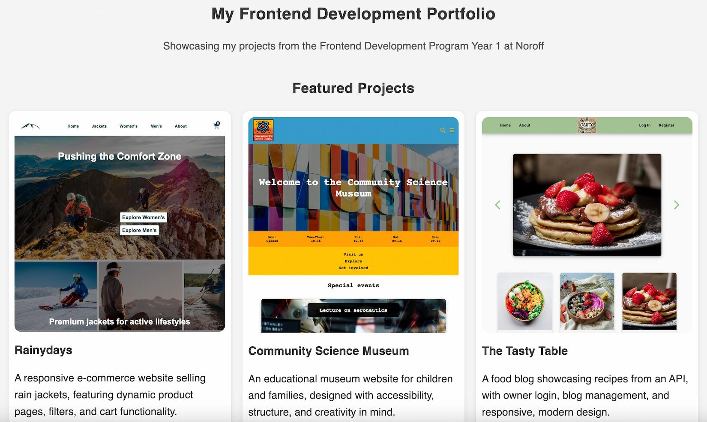

# 🧑‍💻 Portfolio 1 – Ingelinn Hallseth

This is a single-page portfolio website showcasing three frontend development projects completed during the Noroff Frontend Development program year 1. The portfolio highlights progress in design, semantic HTML, responsive CSS, and JavaScript through project improvements and reflections.

---

## 📌 Purpose

The goal of this project is to:

- Self-assess and reflect on previous assignments.
- Improve older projects using new skills and teacher feedback.
- Showcase frontend development progress in a single-page portfolio site.
- Present three graded assignments: Cross Course Project, Semester Project 1, and Exam Project 1.

---

## 🖼️ Featured Projects

Each project includes:

- ✅ Optimized thumbnail preview (≤200KB)
- ✅ Title and short teaser description
- ✅ Public GitHub repository link
- ✅ Live site demo link
- ✅ Reflection and improvement summary in a PDF report

---

## 🧰 Built With

- **HTML5** – Semantic and accessible
- **CSS3** – No frameworks, responsive with Flexbox and Grid
- **Vanilla JavaScript** – Simple DOM manipulation and logic

---

## 🚀 Getting Started

To view the site locally:

1. Clone the repository:
   git clone https://github.com/hallsi90/FED1-POR1-hallsi90.git

2. Open the file index.html in your browser

This is a static site – no installation is required

---

## 📄 Reflection Report

You’ll find the full self-assessment and project reflections in the reflection-report.pdf file.

It includes:

- Project summaries.
- Teacher feedback.
- Self-assessment.
- Improvements made for Portfolio 1.
- Areas of growth and future improvement ideas.

---

## ✅ Status

- 🎓 Portfolio completed as part of the Portfolio 1 Course Assignment at Noroff
- 📂 Includes updated and improved versions of all three projects
- 🔗 All links (GitHub + live demos) are public and verified

---

## 🙏 Acknowledgments

- Noroff Frontend Development Program
- Teacher feedback and support
- Tools like Lighthouse, WAVE, and W3C Validators

---

## 📄 License

This project was created for educational purposes as part of the Noroff Frontend Development program and is not intended for commercial use.

---

🔗 Useful Links

- [GitHub Repository](https://github.com/hallsi90/FED1-POR1-hallsi90)
- [Live Portfolio Website](https://portfolio-1-hallsi90.netlify.app/)
- [Reflection Report (PDF)](./reflection-report.pdf)
